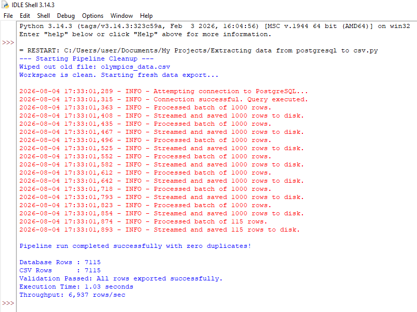

# PostgreSQL-Batch-Export-Pipeline

A Python-based ETL extraction pipeline that streams olympic games data from PostgreSQL and exports it to CSV or Parquet using memory-efficient batch processing.

## Project Overview

This project demonstrates how to extract large datasets from PostgreSQL without loading the entire dataset into memory.

The pipeline streams query results in configurable batches, writes them incrementally to disk, validates exported row counts, measures execution time, and logs pipeline activity.

## Features

- Streaming extraction using SQLAlchemy
- Batch processing with configurable chunk sizes
- CSV export
- Parquet export
- Automatic workspace cleanup
- Data validation (database rows vs exported rows)
- Structured logging
- Execution time measurement
- Throughput reporting
- Error handling

## Technologies

- Python
- PostgreSQL
- SQLAlchemy
- Pandas
- PyArrow
- Logging

## Pipeline Workflow

PostgreSQL

↓

SQL Query

↓

Streaming Extraction

↓

Batch Processing

↓

CSV / Parquet Export

↓

Row Count Validation

↓

Execution Report

## Results

Example execution:

- Rows exported: 7,115
- Execution time: 1.03 seconds
- Throughput: 6,937 rows/sec
- Validation: Passed

## Pipeline Execution

## Project Structure

[Program Codes](./src/)

[Docs](./docs/)

[sample output](./sample_output/)

## Future Improvements

- Incremental loading
- Parallel exports
- Configuration file
- Environment variables
- Cloud storage support
- Airflow orchestration

## Author

Isaac Inyang
